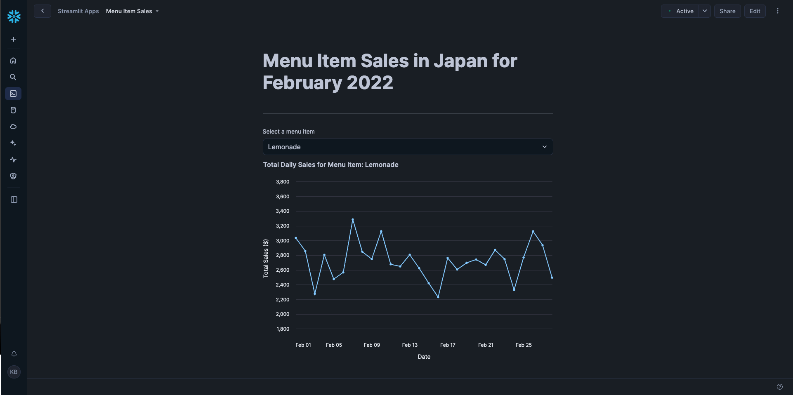

# Zero to Snowflake - TastyBytes Course

A comprehensive hands-on course to learn Snowflake fundamentals through a food truck business scenario called "TastyBytes".

## Course Overview

This course takes you from zero to proficient in Snowflake through practical exercises using a fictional food truck company's data. You'll learn core Snowflake concepts, data engineering, AI/SQL functions, governance, and application development.

## Course Structure

### Prerequisites
- Access to a Snowflake account
- Basic SQL knowledge recommended
- Web browser for Snowsight interface

### Course Modules

| Module | File | Duration | Topics Covered |
|--------|------|----------|----------------|
| **Setup** | [setup.sql](setup.sql) | 30 min | Database setup, roles, warehouses, initial data load |
| **Module 1** | [vignette-1.sql](vignette-1.sql) | 45 min | Virtual warehouses, query results cache, transformations, time travel |
| **Module 2** | [vignette-2.sql](vignette-2.sql) | 60 min | Data pipelines, semi-structured data, dynamic tables, DAG visualization |
| **Module 3** | [vignette-3.sql](vignette-3.sql) | 45 min | AI/SQL functions: sentiment analysis, classification, summarization |
| **Module 4** | [vignette-4.sql](vignette-4.sql) | 75 min | Governance, security, masking policies, row-level security, data quality |
| **Module 5** | [vignette-5.sql](vignette-5.sql) | 60 min | Marketplace data, external data integration, collaboration |
| **Streamlit App** | [app.py](app.py) | 30 min | Building interactive dashboards with Streamlit |

## Getting Started

### Step 1: Initial Setup
1. Run the [setup.sql](setup.sql) script first to create the foundational infrastructure
2. This will create:
   - Database: `tb_101` with multiple schemas
   - Warehouses: `tb_de_wh`, `tb_dev_wh`, `tb_analyst_wh`, `tb_cortex_wh`
   - Roles: `tb_admin`, `tb_data_engineer`, `tb_dev`, `tb_analyst`
   - Sample data for TastyBytes food trucks

### Step 2: Execute Modules Sequentially
Follow the modules in order, as each builds upon the previous one.

## Module Deep Dive

### Module 1: Getting Started with Snowflake
**File:** [vignette-1.sql](vignette-1.sql)

**Key Learning Objectives:**
- Understanding virtual warehouses and their configuration
- Working with query result cache for performance optimization
- Basic data transformations using semi-structured data
- Data recovery using Time Travel and UNDROP
- Resource monitoring and budgets

**Hands-on Activities:**
- Create and configure warehouses with different sizes
- Experience query result caching benefits
- Transform truck data using VARIANT data types
- Recover accidentally dropped tables
- Set up resource monitors and budgets

### Module 2: Simple Data Pipeline
**File:** [vignette-2.sql](vignette-2.sql)

**Key Learning Objectives:**
- Data ingestion from external stages
- Working with semi-structured JSON data using VARIANT
- Building automated pipelines with Dynamic Tables
- Understanding data lineage through DAG visualization

**Hands-on Activities:**
- Load CSV data from S3 using stages
- Extract data from nested JSON structures using FLATTEN
- Create Dynamic Tables for automated data processing
- Build ingredient tracking pipeline
- Visualize pipeline dependencies

### Module 3: AI/SQL Functions
**File:** [vignette-3.sql](vignette-3.sql)

**Key Learning Objectives:**
- Sentiment analysis at scale using SENTIMENT()
- Text classification with AI_CLASSIFY()
- Information extraction using EXTRACT_ANSWER()
- Text summarization with AI_SUMMARIZE_AGG()

**Hands-on Activities:**
- Analyze customer sentiment across food truck brands
- Categorize reviews by business themes
- Extract specific operational insights from reviews
- Generate executive summaries from customer feedback

### Module 4: Governance with Horizon
**File:** [vignette-4.sql](vignette-4.sql)

**Key Learning Objectives:**
- Role-based access control (RBAC) implementation
- Automated data classification and tagging
- Column-level security with masking policies
- Row-level security with access policies
- Data quality monitoring using Data Metric Functions
- Account security monitoring with Trust Center

**Hands-on Activities:**
- Create custom roles and assign privileges
- Implement auto-tagging for PII data
- Apply masking policies to sensitive columns
- Configure row access policies for geographic data isolation
- Set up data quality checks and monitoring

### Module 5: Apps & Collaboration
**File:** [vignette-5.sql](vignette-5.sql)

**Key Learning Objectives:**
- Acquiring external data from Snowflake Marketplace
- Integrating third-party data with internal datasets
- Advanced analytics combining multiple data sources
- Weather impact analysis on business operations

**Hands-on Activities:**
- Acquire Weather Source data from Marketplace
- Create views combining weather and sales data
- Analyze weather impact on food truck performance
- Work with Safegraph POI data for location analytics

### Streamlit Application
**File:** [app.py](app.py)

**Key Learning Objectives:**
- Building interactive dashboards in Snowflake
- Data visualization with Altair charts
- User interaction through Streamlit widgets
- Real-time data access through Snowpark

**Features:**
- Interactive menu item selector
- Dynamic line charts showing daily sales trends
- Responsive design with container width scaling
- Cached data loading for optimal performance

**Application Preview:**

*Interactive dashboard showing daily sales trends for menu items in Japan*

## Technical Architecture

### Database Structure
```
tb_101/
├── raw_pos/          # Point-of-sale raw data
├── raw_customer/     # Customer raw data  
├── raw_support/      # Support data (reviews)
├── harmonized/       # Cleaned, joined data
├── analytics/        # Business-ready views
├── governance/       # Security & compliance objects
└── semantic_layer/   # Business-friendly semantic layer
```

### Warehouse Configuration
- **tb_de_wh**: Data engineering (Large → XSmall after setup)
- **tb_dev_wh**: Development work (XSmall)
- **tb_analyst_wh**: Analytics workloads (Large, auto-scaling)
- **tb_cortex_wh**: AI/ML and Cortex functions (Large)

### Security Model
- **Role Hierarchy**: accountadmin → tb_admin → tb_data_engineer → tb_dev/tb_analyst
- **Data Classification**: Automated PII tagging
- **Access Control**: Column masking + row-level security
- **Monitoring**: Resource monitors, budgets, Trust Center

## Learning Outcomes

By completing this course, you will:

1. **Master Snowflake Fundamentals**
   - Virtual warehouse management and optimization
   - Understanding Snowflake's architecture and pricing model
   - Query optimization techniques

2. **Build Data Pipelines**
   - Load data from various sources (S3, Marketplace)
   - Transform semi-structured data (JSON, VARIANT)
   - Create automated pipelines with Dynamic Tables

3. **Implement AI-Powered Analytics**
   - Use built-in AI functions for text analysis
   - Perform sentiment analysis and classification
   - Extract insights from unstructured data

4. **Apply Data Governance**
   - Implement comprehensive security models
   - Automate data classification and protection
   - Monitor data quality and account security

5. **Develop Applications**
   - Create interactive dashboards with Streamlit
   - Integrate external data sources
   - Build user-friendly analytics applications

## Troubleshooting

### Common Issues

**1. Warehouse Suspended Error**
```sql
ALTER WAREHOUSE my_wh RESUME;
ALTER WAREHOUSE my_wh SET AUTO_RESUME = TRUE;
```

**2. Permission Denied**
- Ensure you're using the correct role for each module
- Check role hierarchy and grants in [setup.sql](setup.sql)

**3. Data Not Loading**
- Verify stage and file format configuration
- Check COPY INTO command syntax and file paths

**4. Dynamic Tables Not Refreshing**
- Tables refresh based on LAG setting (1-2 minutes)
- Use `SYSTEM$GET_DYNAMIC_TABLE_GRAPH_HISTORY()` to monitor

### Reset Scripts
Each module includes a reset section at the bottom to clean up objects and return to initial state.

## Sample Queries

### Business Intelligence Examples

**Sales Performance by Brand:**
```sql
SELECT
    truck_brand_name,
    COUNT(DISTINCT order_id) AS order_count,
    SUM(price) AS total_sales
FROM analytics.orders_v 
GROUP BY truck_brand_name
ORDER BY total_sales DESC;
```

**Weather Impact Analysis:**
```sql
SELECT
    truck_brand_name,
    AVG(CASE WHEN avg_temp_fahrenheit > 70 THEN daily_sales END) AS warm_day_sales,
    AVG(CASE WHEN avg_temp_fahrenheit <= 70 THEN daily_sales END) AS cool_day_sales
FROM analytics.daily_sales_by_weather_v
GROUP BY truck_brand_name;
```

## Certification Path

This course prepares you for:
- **SnowPro Core Certification**
- **SnowPro Advanced: Data Engineer**
- **SnowPro Advanced: Architect**

## Support Resources

- **Snowflake Documentation**: https://docs.snowflake.com
- **Community**: https://community.snowflake.com
- **Support**: https://support.snowflake.com
- **Training**: https://learn.snowflake.com

## Next Steps

After completing this course:
1. Explore advanced Snowflake features (Streams, Tasks, External Functions)
2. Learn about Snowflake's data sharing and marketplace ecosystem
3. Dive deeper into machine learning with Snowpark ML
4. Explore real-time analytics with dynamic tables and streams
5. Build production-ready data applications

---

**Happy Learning!**

*This course provides hands-on experience with real-world scenarios to help you become proficient in Snowflake's data cloud platform.*